<!--
**arberzylyftari/arberzylyftari** is a ✨ _special_ ✨ repository because its `README.md` (this file) appears on your GitHub profile.

Here are some ideas to get you started:

- 🔭 I’m currently working on ...
- 🌱 I’m currently learning ...
- 👯 I’m looking to collaborate on ...
- 🤔 I’m looking for help with ...
- 💬 Ask me about ...
- 📫 How to reach me: ...
- 😄 Pronouns: ...
- ⚡ Fun fact: ...
-->
# Hi, I'm Arber 👋

Machine Learning Engineer | Full-Stack Developer | AI Systems Builder  

I build intelligent systems that automate workflows, classify data, and solve real-world problems.

---

## 🚀 Current Focus
- Deep Learning & Computer Vision
- AI-powered workflow automation (B2B SaaS)
- Scalable backend systems (Node.js + PostgreSQL)

---

## 🧠 Tech Stack

**Languages:**  
Python • JavaScript • Java • SQL  

**ML / AI:**  
TensorFlow • Keras • scikit-learn • Pandas • NumPy  

**Frontend:**  
React • TailwindCSS  

**Backend:**  
Node.js • Express • PostgreSQL  

---

## 🔥 Featured Projects

### 🧠 Rock Paper Scissors ML
CNN model trained for image classification.

### 🎮 2048 Game
Pure JavaScript implementation.

### 🔐 Node Auth App
Authentication system with backend logic.

---

## 📫 Connect With Me

LinkedIn: https://linkedin.com/in/arber-zylyftari  
Medium: https://medium.com/@arberzylyftari123

